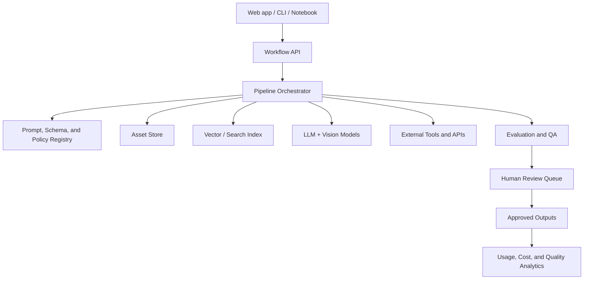
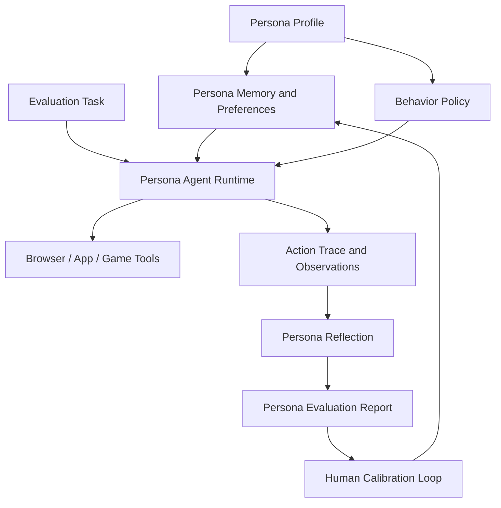

```mermaid
flowchart LR
  Input[Concept Package] --> Planner[Creative Brief Planner]
  Planner --> Script[Script + Shot List Generator]
  Script --> Storyboard[Storyboard Builder]
  Storyboard --> AssetPrep[Image Prep and Brand Layouts]
  AssetPrep --> VideoGen[Video Generation Adapter]
  VideoGen --> Edit[Automated Editing]
  Edit --> QA[Brand, Claims, and Quality QA]
  QA --> Review[Human Review]
  Review --> Export[MP4, Captions, Thumbnail, Metadata]
```

# Nestlé Automation Tooling Architecture

This repository scopes three reusable automation projects for Nestlé-related concept development workflows. The recommended approach is a modular platform with shared data contracts, orchestration, retrieval, evaluation, and reporting primitives so each workflow can be reused independently or composed into larger pipelines.


## If you just want to run it

Open the repository folder in VS Code or Cursor, open a terminal, and run:

```bash
cd /workspace/TaskMaksimTest
./scripts/run_local.sh
```

For a step-by-step French guide, see `LANCER_LE_PROJET.md`.

## How to verify this first version works

This first version is a foundation, not a fully connected production system. It works if the local schemas can be imported, realistic sample inputs can be loaded, and the smoke-test script can create representative objects for the video, RSP, and persona workflows.

### 1. Run the automated tests

```bash
python -m pytest
```

Expected result: all tests pass. These tests validate the initial schema contracts, including currency normalization, benchmark price observations, persona tasks, and the minimum concept payload.

### 2. Run the local workflow smoke test

```bash
PYTHONPATH=packages/schemas python scripts/smoke_test_workflows.py
```

Expected result: the command prints five `OK:` lines confirming that the sample concept loads, a video brief is created, benchmark peers load, an RSP recommendation is produced, and a persona task is created. This test intentionally avoids external AI, video, retailer, and browser APIs so it is deterministic and safe to run locally.

### 3. Inspect the sample inputs

- `examples/sample_concept.json` shows the minimum concept, benefits, reasons to believe, and brand-guideline inputs expected by the future video and persona workflows.
- `examples/sample_benchmark.json` shows the peer-product and price-observation inputs expected by the RSP workflow.

### 4. What is not working yet

The current repository does not yet generate real videos, scrape live retailer prices, or drive a browser as a persona. Those are the next implementation milestones after this foundation: add provider adapters, connect approved data sources, and build workflow services around these contracts.

## Platform principles

- **Modular by default:** each workflow is packaged as a service or library with explicit inputs, outputs, and versioned schemas.
- **Human-in-the-loop controls:** brand, legal, nutrition, pricing, and market research checkpoints remain reviewable before external publication or business use.
- **Traceable outputs:** every video, benchmark, RSP recommendation, and persona evaluation stores source inputs, model versions, prompts, assumptions, confidence scores, and reviewer decisions.
- **Brand-safe generation:** brand guidelines, market restrictions, claims rules, and asset usage rights are enforced through policy checks before final artifacts are approved.
- **Composable orchestration:** workflows can run from a CLI, API, scheduled job, notebook, or product UI using the same core pipeline definitions.

## Shared reference architecture



### Shared components

| Component | Purpose | Candidate tools |
| --- | --- | --- |
| Workflow API | Single entry point for starting, tracking, and retrieving pipeline runs | FastAPI, NestJS, Django Ninja |
| Orchestrator | DAG execution, retries, caching, and observability | Prefect, Temporal, Dagster, Celery |
| Schema registry | Versioned contracts for concepts, brands, benchmarks, personas, and outputs | Pydantic, JSON Schema, OpenAPI |
| Prompt registry | Versioned prompts and model configs with experiment tracking | LangSmith, Braintrust, custom Git-backed registry |
| Asset store | Product images, storyboards, videos, benchmark evidence, persona traces | S3, Azure Blob Storage, GCS |
| Retrieval layer | Search over brand guidelines, past concepts, claims rules, personas, and market data | PostgreSQL + pgvector, OpenSearch, Pinecone |
| Tool adapters | Normalized wrappers around web search, scraping, video, image, pricing, and browser tools | Playwright, Firecrawl, SerpAPI, Apify, Runway, Luma, FFmpeg |
| Evaluation harness | Automated QA, rubric scoring, regression checks, and audit trails | pytest, DeepEval, Ragas, Braintrust, custom rubrics |
| Review queue | Human approvals for brand safety, price assumptions, and persona realism | Retool, Streamlit, internal web app |

## Project 1: Automated marketing video generation

### Goal

Generate short marketing videos for new product concepts from a concept description, generated images, benefits, target audience, and brand guidelines.

### Proposed architecture



### Core modules

1. **Concept package parser**
   - Inputs: product name, concept statement, benefits, reasons to believe, audience, image assets, brand guidelines, required disclaimers, market.
   - Output: normalized `ConceptVideoBrief` schema.
2. **Creative brief planner**
   - Converts product strategy into a creative angle, tone, visual style, and video objective.
   - Retrieves brand rules and previous approved examples.
3. **Script and storyboard generator**
   - Produces a 15-30 second script, scene list, voiceover, on-screen text, CTA, and asset mapping.
   - Supports variants for social, retailer presentation, internal concept testing, and e-commerce.
4. **Video generation adapter**
   - Abstract interface so providers can be swapped.
   - Candidate APIs: Runway, Luma, Pika, Stability AI video, Google Veo where available, or internal approved vendors.
5. **Assembly and post-processing**
   - Uses FFmpeg or MoviePy for cuts, captions, end cards, music ducking, aspect ratios, and export presets.
6. **QA and approval**
   - Checks brand colors, logo placement, forbidden claims, disclaimer presence, subtitle readability, audio duration, and basic accessibility.

### Milestones

| Milestone | Outcome | Acceptance criteria |
| --- | --- | --- |
| M1: Input schemas and CLI prototype | Reusable schema plus local command to generate scripts and storyboards | Given a concept JSON, the CLI produces a structured storyboard and script |
| M2: Asset preparation and template rendering | Static storyboard frames with brand-compliant layouts | Frames include product image, copy, logo, CTA, and required disclaimers |
| M3: Video provider integration | First automated video draft | Pipeline produces a 15-30 second MP4 from generated images and storyboard |
| M4: QA gates | Automated checks before review | Pipeline flags missing disclaimers, unsupported claims, low-resolution assets, and duration issues |
| M5: Batch generation and review UI | Multiple creative variants per concept | Users can compare variants, approve one, and export final assets |

### Suggested stack

- Python for orchestration and media processing.
- FastAPI for API endpoints.
- Prefect or Temporal for repeatable pipelines.
- Pydantic for schemas.
- FFmpeg and MoviePy for deterministic editing.
- Playwright only if provider workflows require browser automation.
- A provider adapter pattern for Runway, Luma, Pika, or enterprise-approved tools.

## Project 2: Automated benchmarking and RSP recommendation

### Goal

Identify peer products, collect or estimate prices, compare them with a new concept, and recommend a retail selling price with rationale.

### Proposed architecture


### Core modules

1. **Peer product finder**
   - Uses category, format, claims, occasion, brand tier, target consumer, ingredients, and market to identify comparable products.
   - Combines retrieval from existing benchmark databases with web search and retailer search.
2. **Price collector**
   - Pulls listed prices from retailers, grocery marketplaces, internal datasets, and syndicated data where licensed.
   - Stores source URL, timestamp, pack size, promotion status, currency, and availability.
3. **Normalizer**
   - Converts prices to comparable units such as price per 100g, per serving, per capsule, or per litre.
   - Handles multi-packs, promotions, outliers, and currency conversion.
4. **Comparator**
   - Scores similarity across category, pack format, brand tier, benefit claims, ingredients, occasion, and target audience.
5. **RSP recommendation engine**
   - Produces recommended RSP, acceptable range, confidence level, key assumptions, and sensitivity analysis.
   - Supports rule-based pricing logic plus LLM-generated narrative rationale.
6. **Evidence report generator**
   - Outputs an audit-friendly report with peer table, source links, normalization notes, and final recommendation.

### Milestones

| Milestone | Outcome | Acceptance criteria |
| --- | --- | --- |
| M1: Benchmark schema and manual data import | Structured comparison workbook replacement | CSV or JSON peer data can produce a normalized benchmark table |
| M2: Retailer search adapters | Automated price evidence collection | Given a market and category, the pipeline returns source-backed peer products and prices |
| M3: Similarity scoring | Ranked peer set | Peer products are ranked with transparent similarity reasons |
| M4: RSP model | Price recommendation with rationale | System returns recommended RSP, range, confidence, assumptions, and sensitivity notes |
| M5: Review-ready report | Commercial-facing output | Report exports to PDF, PPT, or web page with all evidence and caveats |

### Suggested stack

- Python, FastAPI, Pandas, Pydantic, and SQLAlchemy.
- PostgreSQL for benchmark records and run history.
- Playwright, Firecrawl, Apify, retailer APIs, or licensed syndicated data for price collection.
- OpenSearch or pgvector for product matching.
- Exchange-rate API if cross-market pricing is needed.
- Great Expectations or Pandera for data quality checks.

### Pricing model outline

```text
recommended_rsp = weighted_peer_anchor
                + premium_for_incremental_benefits
                + brand_tier_adjustment
                + pack_format_adjustment
                + channel_adjustment
                - promo_risk_adjustment
```

Each adjustment should be explicitly stored with a source or assumption so reviewers can challenge or override it.

## Project 3: Synthetic persona agent v2

### Goal

Embed a synthetic persona into an agent framework so it can play games, review websites, test apps, and evaluate portals from the persona's perspective.

### Proposed architecture



### Core modules

1. **Persona compiler**
   - Converts research-backed persona data into an executable profile: demographics, goals, constraints, brand attitudes, shopping habits, digital fluency, accessibility needs, and decision heuristics.
2. **Agent runtime**
   - Uses a framework such as LangGraph, OpenAI Agents SDK, AutoGen, CrewAI, or a forked browser-agent framework such as OpenCLAW if it provides useful web interaction primitives.
3. **Tool layer**
   - Browser control: Playwright.
   - App testing: Appium for mobile, Playwright for web, custom APIs for games or portals.
   - Vision and DOM inspection: screenshot plus accessibility tree plus DOM extraction.
4. **Persona memory**
   - Stores stable persona traits, episodic task memory, brand history, and preference embeddings.
   - Separates immutable research data from mutable session observations.
5. **Task execution loop**
   - Observe, interpret through persona lens, decide, act, record rationale, and reflect.
6. **Calibration and evaluation**
   - Compares agent behavior against human panel data, known persona constraints, and expert rubric ratings.
   - Measures consistency, realism, task success, and bias drift.

### Milestones

| Milestone | Outcome | Acceptance criteria |
| --- | --- | --- |
| M1: Persona schema v2 | Executable persona contract | A persona profile can be validated and loaded into an agent prompt and memory store |
| M2: Browser evaluation prototype | Persona can review websites | Agent completes a guided website task and produces persona-grounded feedback with trace evidence |
| M3: Memory and consistency layer | Persona remains consistent across sessions | Repeated tasks preserve stable preferences and produce explainable choices |
| M4: App and game adapters | Persona can interact beyond websites | Agent can run scripted tests in a web app or simple game environment |
| M5: Calibration harness | Quality scoring and regression testing | Human reviewers can score realism, and automated tests detect persona drift |
| M6: OpenCLAW assessment or fork | Decide whether to fork, wrap, or replace OpenCLAW | Technical spike documents integration effort, licensing, maintenance burden, and gaps |

### Suggested stack

- LangGraph for stateful agent flows.
- Playwright for browser automation and screenshots.
- Appium for mobile workflows.
- PostgreSQL plus pgvector for persona memory and task traces.
- OpenTelemetry for traceability.
- Braintrust, LangSmith, or custom rubric evaluation for agent QA.
- Dockerized sandbox environments for repeatable app and game tests.

## Implementation plan

### Phase 0: Foundation, 1-2 weeks

- Define shared schemas for concepts, brand guidelines, product assets, benchmark products, price observations, personas, agent tasks, and evaluation reports.
- Create a monorepo or service layout with shared libraries and workflow-specific packages.
- Set up CI, linting, tests, secrets management, and environment configuration.
- Choose an orchestrator and database.

### Phase 1: Fastest production value, 2-4 weeks

Prioritize automated benchmarking because it has the lowest difficulty and clearest acceptance criteria.

- Build manual-import benchmark pipeline.
- Add price normalization and RSP recommendation logic.
- Generate a review-ready report.
- Add source audit trails and reviewer overrides.

### Phase 2: Marketing video MVP, 3-6 weeks

- Build concept-to-storyboard generation.
- Add branded template rendering.
- Integrate one video provider.
- Add FFmpeg export and QA gates.
- Add human review before final delivery.

### Phase 3: Persona agent v2 prototype, 6-10 weeks

- Build persona schema v2 and browser agent prototype.
- Add memory separation, trace logging, and calibration rubrics.
- Test on website review tasks first, then expand to apps and games.
- Run an OpenCLAW technical spike before committing to a fork.

### Phase 4: Platform hardening, ongoing

- Add workflow dashboards, cost controls, and model/provider fallback.
- Add regression suites for prompts, pricing recommendations, and persona consistency.
- Build reusable UI components for run history, evidence review, approvals, and exports.
- Establish governance for brand, legal, data privacy, and market-specific constraints.

## Recommended repository structure

```text
apps/
  api/                       # Workflow API
  review-ui/                 # Human review and approvals
packages/
  schemas/                   # Pydantic models and JSON schemas
  orchestration/             # Shared pipeline utilities
  retrieval/                 # Search and vector-store adapters
  evaluation/                # Rubrics, QA checks, regression tests
  reporting/                 # PDF, PPT, and HTML report generation
workflows/
  video_generation/          # Concept-to-video pipeline
  rsp_recommendation/        # Benchmarking and pricing pipeline
  persona_agent/             # Synthetic persona v2 runtime
integrations/
  video_providers/           # Runway, Luma, Pika, etc.
  retailers/                 # Retailer and price-source adapters
  browser_tools/             # Playwright and Appium wrappers
configs/
  brands/                    # Brand guideline configs
  markets/                   # Market and currency configs
  prompts/                   # Versioned prompts
```

## Key risks and mitigations

| Risk | Impact | Mitigation |
| --- | --- | --- |
| Brand or claims non-compliance in generated video | High | Enforce rules-based QA, retrieval from approved guidelines, and mandatory review |
| Unreliable or legally restricted price scraping | Medium to high | Prefer licensed data and official APIs; store source terms and timestamps |
| RSP recommendations over-trusted as final pricing | Medium | Present ranges, assumptions, confidence, and reviewer overrides |
| Persona agent stereotypes or drifts from research | High | Ground personas in approved research, calibrate against panels, and test consistency |
| Tool/provider lock-in | Medium | Use adapter interfaces and store provider-agnostic intermediate artifacts |
| Cost and latency | Medium | Cache retrieval, batch jobs, model routing, and provider budgets |

## First implementation tickets

1. Create shared schemas for `Concept`, `BrandGuidelines`, `ConceptAsset`, `BenchmarkProduct`, `PriceObservation`, `RSPRecommendation`, `PersonaProfile`, and `PersonaTask`.
2. Build the RSP pipeline with CSV import, unit normalization, peer ranking, and report generation.
3. Build the video storyboard generator and static branded frame renderer.
4. Build the persona schema v2 and a Playwright website-review prototype.
5. Add run tracing, output storage, and human review states for all three workflows.
